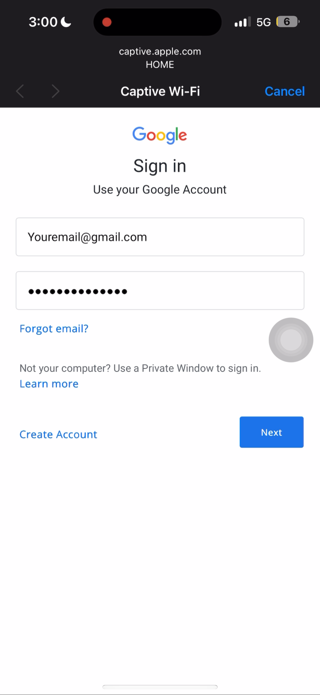
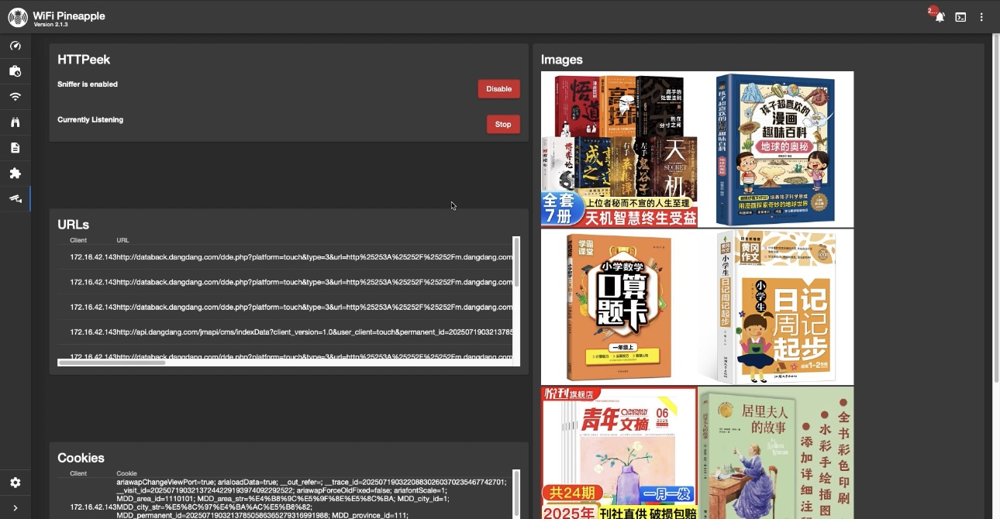
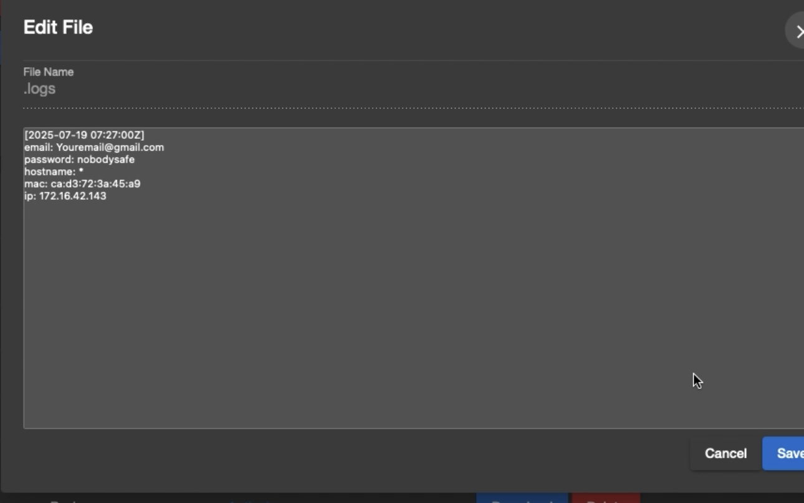

# 🍍 WiFi Pineapple: Evil Portal Lab

Testing, customizing, and deploying Evil Portals using the WiFi Pineapple for wireless social engineering and captive portal hijacks.

---

##  Project Scope

This lab involves using Hak5’s WiFi Pineapple to:

- Clone login portals (Google, Yahoo, etc.)
- Trigger credential collection
- Monitor victim traffic (HTTP only)

---

## Tools & Modules

- Evil Portal
- httPeek (for packet logging)
- DNS Spoof
- Custom captive portal HTML/CSS

---

##  What I've Done

- ✅ Installed Evil Portal via Pineapple GUI  
- ✅ Created a custom fake login screen  
- ✅ Captured HTTP POST requests using httPeek  
- ✅ Validated victim MAC address via recon module  

---

## ⚠️ Legal Disclaimer

This is a **red team simulation tool** built for educational and legal lab use only.  
Do not use on unauthorized networks or without explicit permission.

---

## 📸 Preview

---

## 📝 Notes

- Pineapple AP name rotates randomly to avoid detection  
- Test against mobile devices with captive portal triggers  
- Considering MAC whitelist bypass for personal devices
